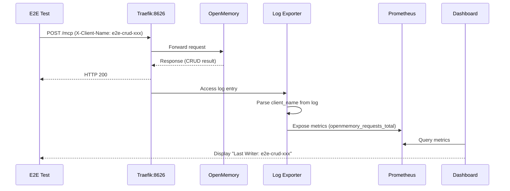

# CyberMem Project Context

## 1. CyberMem Project Overview
**CyberMem** is a production-grade AI memory system wrapping [OpenMemory](https://github.com/CaviraOSS/OpenMemory) with specific DevOps infrastructure.

**Goal**: Provide monitoring, observability, and multi-platform support (Local, RPi, VPS) without modifying OpenMemory code.
> [!CAUTION]
> **Core Principle**: "No code modifications to OpenMemory" (it's a git submodule). Logic is implemented via sidecars (Vector, Traefik) and database exporters.

### Landing and Documentation
- **Landing**: [https://cybermem.dev](https://cybermem.dev)
- **Documentation**: [https://cybermem.dev/docs](https://cybermem.dev/docs)
- **Source Code**: [https://github.com/mikhailkogan17/cybermem](https://github.com/mikhailkogan17/cybermem)
- **Readme**: [https://github.com/mikhailkogan17/cybermem/blob/main/README.md](https://github.com/mikhailkogan17/cybermem/blob/main/README.md)

## 2. Technology Stack & Architecture
- **App Core**: OpenMemory (Python/FastAPI) as `external/openmemory` submodule.
- **Infrastructure**:
  - **Networking**: Tailscale Funnel (zero-config public HTTPS for RPi/VPS).
  - **Reverse Proxy**: Traefik (handles auth extraction into logs).
  - **Log Processing**: Vector (parses Traefik access logs -> Prometheus metrics).
  - **Metrics**: Prometheus (scrapes Vector + Postgres Exporter).
  - **Visualization**: Grafana (dashboards for writes/reads, latency, errors).
  - **Database**:
    - **VPS (Cloud)**: PostgreSQL (via Helm charts in CLI templates).
    - **Local/RPi**: SQLite.
  - **Embeddings**: OpenAI (VPS) or Ollama (Local/RPi).
  - **Orchestration**: Docker Compose (Local) -> converted to Helm charts via `kompose` (VPS).
- **Monorepo Architecture**:
  - **NPM Workspaces**: Manages `@cybermem/cli`, `@cybermem/dashboard`, and `@cybermem/mcp-server`.

## 3. Directory Map
- `packages/cli/`: Management CLI (@cybermem/cli)
  - `templates/`: Production-ready configurations (Docker Compose, Helm Charts, Ansible Playbooks, Terraform Modules, Tailscale Funnel).
- `packages/dashboard/`: Monitoring UI (metrics, audit logs) — NOT the public landing page.
- `packages/mcp/`: MCP Server (TypeScript, published as @cybermem/mcp-server).
- `external/openmemory/`: OpenMemory submodule.
- `tools/`: Utility scripts (load_test.sh, e2e tests).
- `README_assets/`: Assets for project documentation.
- `patches/`: OpenMemory patches for customization without modifying submodule.

---

## ⚠️ IMPORTANT: Local Development Configuration

### Port Configuration
> [!IMPORTANT]
> **Port 8626** is the canonical MCP endpoint for local development.
> - Traefik listens on `8626` and routes to OpenMemory internally.
> - Dashboard health checks use `localhost:8626/health`.
> - MCP Server defaults to `localhost:8626/memory`.

| Service               | Local Port | Purpose                       |
| --------------------- | ---------- | ----------------------------- |
| **Traefik (MCP/API)** | 8626       | Main API endpoint, MCP access |
| **Prometheus**        | 9092       | Metrics scraping              |
| **DB Exporter**       | 8000       | SQLite metrics                |
| **Dashboard**         | 3000       | Monitoring UI                 |

### Authentication Bypass (Local Mode)
> [!CAUTION]
> **NO API KEY required for local development.**
> 
> The auth bypass is implemented in `patches/openmemory-auth.patch`:
> - When `CYBERMEM_URL` env var is **NOT set** → Local mode → Auth bypassed
> - When `CYBERMEM_URL` is set → Remote mode → API key required

### MCP Server Configuration
> [!CAUTION]
> **Use `npx` for local MCP, direct SSE for remote.**

**Local Mode (npx):**
```json
{
  "mcpServers": {
    "cybermem": {
      "command": "npx",
      "args": ["-y", "@cybermem/mcp-server"]
    }
  }
}
```
- No `CYBERMEM_URL` = local mode = keyless auth

**Experimental: SSE Local Mode (for custom headers)**
```json
{
  "mcpServers": {
    "cybermem-sse": {
      "url": "http://localhost:8627/sse",
      "transport": "sse"
    }
  }
}
```
> [!IMPORTANT]
> Run the server with `PORT=8627 npx @cybermem/mcp-server --sse` to enable SSE. This allows console utilities to pass `X-Client-Name` as an HTTP header.

**Remote Mode (SSE):**
```json
{
  "mcpServers": {
    "cybermem-remote": {
      "url": "http://<your-rpi-or-vps>:8626/mcp",
      "transport": "sse",
      "headers": {
        "x-api-key": "your-api-key"
      },
      "env": {
        "CYBERMEM_URL": "http://<your-rpi-or-vps>:8626"
      }
    }
  }
}
```

### MCP client names
> [!CAUTION]
> ALWAYS use `X-Client-Name` HTTP header to identify the client IN DASHBOARD. Do NOT use environment variables, hardcoded values, or other means.
There is NO server-side environment variable override for client identity in the MCP server code AND DO NOT ADD IT.

Names to avoid:
> - `cybermem`
> - `cybermem-remote`
> - `cybermem-mcp`
> - `mcp`
> - `mcp-server`
> - `mcp-client`
> - `cli`
> - `mcp-remote`
> - `node`
> - `axios`
> - `unknown`
> - `generic`
> etc.

> - Dashboard maps raw header values (e.g. `antigravity-client`) to display names (e.g. "Antigravity") via `clients.json`.
> - If no match is found, the raw header value is displayed.

### Coding Standards
> [!IMPORTANT]
> **No Hardcoded Client Identity in Shared Libraries:**
> - Do NOT hardcode `X-Client-Name` and do not add comments like "<Value> Identifies the client".
> - Transport layers must facilitate identity propagation, not mask it.
> - Default values must be clearly identified as fallbacks, not fixed identities.

---

## 4. Environment Variables

| Variable           | Default                 | Description                    |
| ------------------ | ----------------------- | ------------------------------ |
| `CYBERMEM_URL`     | (unset for local)       | Set ONLY for remote deployment |
| `CYBERMEM_API_KEY` | (empty for local)       | API key for remote auth        |
| `PROMETHEUS_URL`   | `http://localhost:9092` | Prometheus endpoint            |
| `OLLAMA_URL`       | `http://ollama:11434`   | Local embeddings               |

## 5. Quick Start Commands
```bash
# Start local stack
npx @cybermem/cli init
npx @cybermem/cli up

# Run dashboard in dev mode
cd packages/dashboard && npm run dev

# Test MCP (via MCP-CLI or Antigravity)
# Dashboard will show client activity after operations
```

## 6. Testing
### CRUD
For happy path do NOT use curl, mocking, etc. 
Use ONLY mcp-cli or Antigravity.
> [!CAUTION] 
> **CURL ALLOWED ONLY FOR DEBUGGING.**
> ALWAYS use `npx` in your MCPs JSON config.

### Installation
Always use `npx` to install or run the server.
Do NOT use prometheus mocks, stubs

### Traefik
> [!CAUTION] 
> All requests go through Traefik. Do not bypass it.
Traefik entry point: `http://localhost:8626`

### UI/Unit Testing (playwright)
- CI/CD: needs to run all the tests only 
- Local: needs to run happy path tests for LOCAL and for https://raspberrypi.local (if available)

### Dashboard
The dashboard tracks MCP client activity through Traefik. 

Metrics from Prometheus+Traefik:
- **Last Reader / Last Writer** — Most recent client activity with timestamp
- **Top Reader / Top Writer** — Client with highest operation count
- **4 Time Series Charts:** Creates, Reads, Updates, Deletes
- **Audit Logs** — All operations with timestamps

Metrics from Openmemory directly (4 top metrics):
- **Memory Records**
- **Total Clients**
- **Success Rate**
- **Total Requests**

> [!CAUTION]
> Always check Metrics from Openmemory (4 top) in the **LAST** priority. Use Top Reader / Top Writer / Last Reader / Last Writer for happy path. Use Time Series Charts for regression testing.

---

## 7. CRUD Happy Path Test Flow

### Pipeline Overview



### Test Execution Order

1. **Reset DB** — Remove SQLite files, restart container, wait for health
2. **Initialize** — MCP protocol handshake with `X-Client-Name` header
3. **CREATE** — `openmemory_store` with unique client identifier
4. **READ** — `openmemory_get`, `openmemory_list`, `openmemory_query`
5. **DELETE** — `openmemory_delete` (if available)
6. **Verify Dashboard** — Check "Last Writer" / "Last Reader" shows test client
7. **Reset DB** — Clean up after test suite

### Key Assertions

| Assertion                 | Location   | Method                                               |
| ------------------------- | ---------- | ---------------------------------------------------- |
| Client tracked in metrics | Prometheus | Query `openmemory_requests_total{client_name="..."}` |
| Client visible in UI      | Dashboard  | Check "Last Writer" / "Last Reader" cards            |
| Operations logged         | Audit Log  | Scroll to table, verify client name column           |

### Running the Tests

```bash
# MCP CRUD test (no dashboard verification)
cd packages/cli && npx tsx e2e/test-mcp.ts local

# Metrics tracking test (verifies X-Client-Name in Prometheus)
cd packages/cli && npx tsx e2e/test-metrics.ts

# Full CRUD with dashboard verification (Playwright)
cd packages/dashboard && npm run test:e2e -- crud-happy-path.spec.ts

# Fast run (skip DB reset when stack is already clean)
SKIP_DB_RESET=true npm run test:e2e -- crud-happy-path.spec.ts
```

### DB Reset Considerations

> [!WARNING]
> The `resetDB()` function in tests removes SQLite files. After container restart, ensure file permissions are correct or the container will crash with `SQLITE_READONLY`.

**Manual fix if container crashes:**
```bash
# Fix permissions on data volume
docker run --rm -v cybermem-openmemory-data:/data alpine sh -c 'chown -R 1001:1001 /data && chmod 777 /data'

# Restart container
docker restart cybermem-openmemory
```

**Environment Variables for Tests:**

| Variable        | Default                | Description                                                       |
| --------------- | ---------------------- | ----------------------------------------------------------------- |
| `SKIP_DB_RESET` | `false`                | Set to `true` to skip DB reset in playwright tests                |
| `RPI_URL`       | -                      | RPi MCP endpoint URL (e.g., `https://raspberrypi.local:8626/mcp`) |
| `RPI_API_KEY`   | -                      | API key for RPi authentication                                    |
| `RPI_HOST`      | `pi@raspberrypi.local` | SSH host for RPi DB reset                                         |

> [!NOTE]
> RPi platform compatibility documentation is in global `~/.gemini/GEMINI.md`.
