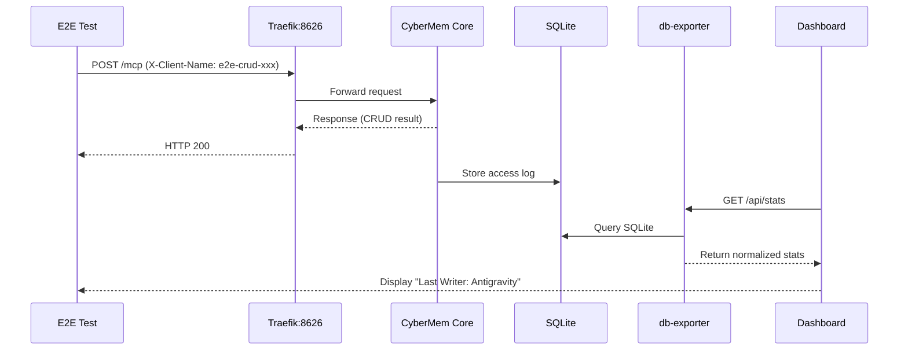

## 1. CyberMem Project Overview

**CyberMem** is a production-grade AI memory system that provides persistent context for AI agents.

**Goal**: Provide monitoring, observability, and multi-platform support (Local, RPi, VPS) with an integrated, high-performance architecture.

### Landing and Documentation

- **Landing**: [https://cybermem.dev](https://cybermem.dev)
- **Documentation**: [https://docs.cybermem.dev](https://docs.cybermem.dev)
- **Source Code**: [https://github.com/mikhailkogan17/cybermem](https://github.com/mikhailkogan17/cybermem)
- **Readme**: [https://github.com/mikhailkogan17/cybermem/blob/main/README.md](https://github.com/mikhailkogan17/cybermem/blob/main/README.md)

> [!CAUTION]
> **It is FORBIDDEN to:**
>
> - Ignore linting rules
> - Ignore GEMINI.md rules
> - Skip workflow steps and/or required Playwright runs
> - Force a commit without fixing a cause (linting, gitleaks, etc)
> - **Commit without running local tests first (`npm run test:e2e`)**

## 2. Terminology Stack & Architecture

- **App Core**: CyberMem Core (TypeScript/SQLite).
- **Infrastructure**:
  - **Networking**: Tailscale Funnel (zero-config public HTTPS for RPi/VPS).
  - **Reverse Proxy**: Traefik (handles auth extraction into logs).
  - **Metrics**: Built-in Dashboard stats (SQLite-based, no Prometheus needed).
  - **Visualization**: Integrated Charts (Canvas/ECharts).
  - **Database**:
    - **VPS (Cloud)**: PostgreSQL (via Helm charts in CLI templates).
    - **Local/RPi**: SQLite (Standard Single Source of Truth).
  - **Embeddings**: OpenAI (VPS) or Ollama (Local/RPi).
  - **Orchestration**: Docker Compose (Local) -> converted to Helm charts via `kompose` (VPS).
- **Monorepo Architecture**:
  - **NPM Workspaces**: Manages `@cybermem/cli`, `@cybermem/dashboard`, and `@cybermem/mcp`.

## 3. Directory Map

- `packages/cli/`: Management CLI (@cybermem/cli)
  - `templates/`: Production-ready configurations (Docker Compose, Helm Charts, Ansible Playbooks, Terraform Modules, Tailscale Funnel).
- `packages/dashboard/`: Monitoring UI (metrics, audit logs) — NOT the public landing page.
- `packages/mcp/`: MCP Server (TypeScript, published as @cybermem/mcp).
- `docs/`: **All documentation** (quickstart, local, rpi, vps, mcp guides).
- `tools/`: Utility scripts (load_test.sh, e2e tests).
- `README_assets/`: Assets for project documentation.

## 3.1 Documentation Rules

> [!CAUTION]
> **ALL new markdown documentation MUST be placed in `/docs/`.**
>
> Allowed `.md` files outside `/docs/`:
>
> - `README.md` (project root only)
> - `CONTRIBUTING.md`
> - `GEMINI.md`
> - `.agent/workflows/*.md` (agent workflows)
>
> DO NOT create new `.md` files in other locations. Documentation on docs.cybermem.dev is generated from `/docs/` via submodule.

---

## ⚠️ Environment Classification (CRITICAL)

> [!CAUTION]
> **Local = DEV, RPi = PROD**
>
> | Environment           | Type | Data Safety                  |
> | --------------------- | ---- | ---------------------------- |
> | **localhost**         | DEV  | Can wipe, reset, test freely |
> | **raspberrypi.local** | PROD | **READ-ONLY**. Never modify. |

### Test Workflow Rules

| Workflow               | Local                 | RPi                     |
| ---------------------- | --------------------- | ----------------------- |
| `/test-local`          | ✅ Full CRUD + DB wipe | ❌ Never run             |
| `/test-rpi`            | ❌ N/A                 | ✅ Read-only checks only |
| `/test-backup-restore` | ✅ Restore TO local    | ❌ Backup FROM RPi only  |
| `/sync-from-rpi`       | ✅ Receive data        | ❌ Source only (read)    |

---

## ⚠️ IMPORTANT: Local Development Configuration

### Port Configuration

> [!IMPORTANT]
> **Port 8626** is the canonical MCP endpoint for local development.
>
> - Traefik listens on `8626` and routes to CyberMem Core internally.
> - Dashboard health checks use `localhost:8626/health`.
> - MCP Server defaults to `localhost:8626/mcp`.

| Service               | Local Port | Purpose                       |
| --------------------- | ---------- | ----------------------------- |
| **Traefik (MCP/API)** | 8626       | Main API endpoint, MCP access |
| **DB Exporter**       | 8000       | SQLite metrics                |
| **Dashboard**         | 3000       | Monitoring UI                 |

### Authentication (Security Token)

> [!CAUTION]
> **Local mode mimics production auth but allows bypass if CYBERMEM_URL is unset.**
>
> Standard terminology is **Security Token**. Use the `--token` argument in CLI or MCP configuration.

---

## 4. Environment Variables

| Variable         | Default               | Description                    |
| ---------------- | --------------------- | ------------------------------ |
| `CYBERMEM_URL`   | (unset for local)     | Set ONLY for remote deployment |
| `CYBERMEM_TOKEN` | (empty for local)     | Security Token for remote auth |
| `OLLAMA_URL`     | `http://ollama:11434` | Local embeddings               |

## 5. Quick Start Commands

```bash
# Start local stack
npx @cybermem/cli init
npx @cybermem/cli up

# Run dashboard in dev mode
cd packages/dashboard && npm run dev
```

## 6. Testing

### CRUD

For happy path do NOT use curl, mocking, etc.
Use ONLY mcp-cli or Antigravity.

> [!CAUTION]
> **CURL ALLOWED ONLY FOR DEBUGGING.**
> ALWAYS use `npx` in your MCPs JSON config.

### Dashboard

The dashboard tracks MCP client activity through db-exporter (SQLite) and visualizes it via the Metrics API.

> [!IMPORTANT]
> **Dashboard uses SQLite as the Single Source of Truth (SSoT):**
>
> - **Stat Cards**: SQLite directly.
> - **Time Series Charts**: Beautiful Linear Sampling algorithm.

---

## 8. CLI Commands

### Management Commands

| Command     | Description                                        |
| ----------- | -------------------------------------------------- |
| `init`      | Initialize CyberMem configuration and templates    |
| `up`        | Start the full Docker stack (Traefik, Core, etc.)  |
| `dashboard` | Checks ports (3000) and opens the local dashboard. |
| `update`    | Upgrade images and pull latest changes             |
| `reset`     | Wipe database (DESTRUCTIVE)                        |

### Memory Tools (MCP)

| Tool            | Implementation                                                     |
| --------------- | ------------------------------------------------------------------ |
| `add_memory`    | Store new memory with tags                                         |
| `query_memory`  | Semantic search                                                    |
| `list_memories` | Pagination and list                                                |
| `delete_memory` | Direct SQLite Scrub (Transactional delete from all related tables) |

---

## 9. CRUD Happy Path Test Flow

### Pipeline Overview



---

## 10. Architectural Decision Records (ADR)

### ADR-001: Beautiful Local Charts (v0.7.2)

- **Problem**: Raw event-based charts caused "uneven scale" or "metamorphoses" when events were irregular.
- **Solution**: Implemented **Beautiful Linear Sampling**. Instead of plotting raw timestamps, we generate 60 fixed buckets on a timeline.
- **Benefit**: Smooth, Grafana-level charts using direct SQLite aggregation. No external metrics servers required.

### ADR-002: Direct SQLite Scrub (v0.7.0)

- **Problem**: Standard SDK did not support hard deletion across all tables.
- **Solution**: Implemented direct SQLite manipulation in the MCP server sidecar.
- **Scope**: Deletes from `memories`, `vectors`, and `waypoints` tables using transactions.

### ADR-003: Port 8626 Canonicalization

- **Problem**: Port conflicts with default 8080/4000/3000.
- **Solution**: Port **8626** is the dedicated entry point for Traefik, which routes all MCP and API traffic.

---

## 11. Metadata & Maintenance

### Maintenance Commands

- `/refresh-docs`: Sync landing and main repo.
- `/test-backup-restore`: Verify RPi -> Local data sync.
- `/release`: Bump versions and trigger OIDC publish.
