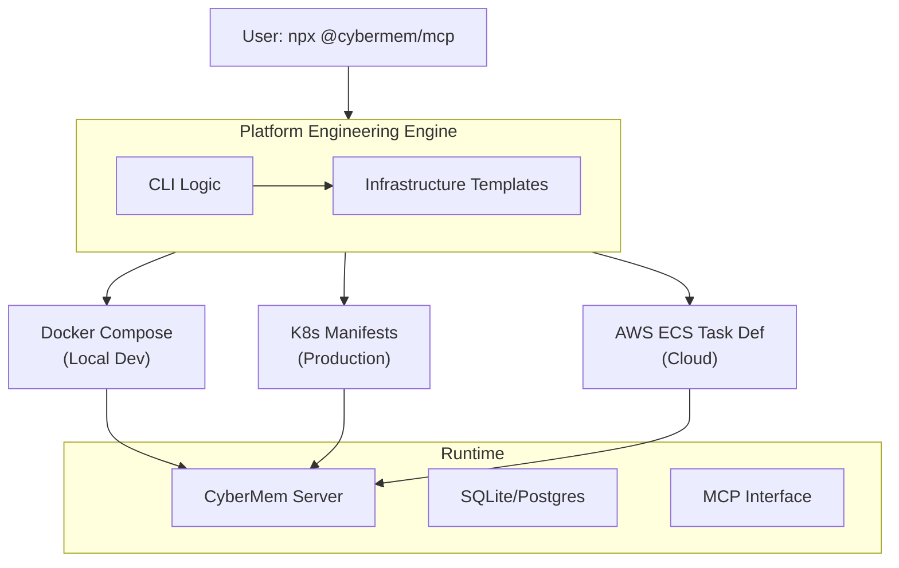

<div align="center">
  
  <h1>CyberMem</h1>
  <p>Two-tier memory Service (Active Context + Long-term Archival) for AI Agents</p>

  <a href="https://docs.cybermem.dev">
    
  </a>
  <a href="https://github.com/mikhailkogan17/cybermem/pkgs/container/cybermem">
    
  </a>
   <a href="https://github.com/mikhailkogan17/cybermem/blob/main/LICENSE">
    
  </a>
</div>

<br/>

> **AI Memory Infrastructure** + **Platform Engineering Template Generator**

Single unified memory layer for AI agents, deployable anywhere.

---

## What's Included?

### Core Features
- Self-hosted AI persistent memory (MCP-native)
- Multi-platform deployment (Docker, K8s, AWS ECS, Raspberry Pi, VPS)
- Built-in monitoring & observability (Prometheus metrics)

### Platform Engineering (The Secret Sauce)
- **Monorepo structure** with packages for CLI, templates, and core
- **Infrastructure templates** auto-generated for any environment
- **E2E testing** across deployment platforms
- **Production-hardened** security defaults

---

## Architecture Overview



---

## How It Works

### 1. Installation (One-liner)
```bash
npx @cybermem/mcp
```

### 2. CLI Auto-Generates Infrastructure
The CLI intelligently generates deployment configs based on your target platform:

```bash
npx @cybermem/mcp --target docker-compose   # Creates docker-compose.yml
npx @cybermem/mcp --target k8s              # Creates Kubernetes manifests (v0.3.0)
npx @cybermem/mcp --target aws-ecs          # Creates ECS task definition (v0.3.0)
```

**Under the hood** (in `packages/cli/templates`):
- Reads environment variables
- Generates optimized YAML/JSON from templates
- Validates configuration
- Runs E2E tests to ensure deployment works

### 3. Deploy Anywhere
- **Local:** `docker-compose up`
- **Kubernetes:** `kubectl apply -f manifests/`
- **AWS:** `aws ecs register-task-definition`
- **Raspberry Pi:** Single binary, no dependencies

---

## Project Structure (Monorepo)

```
cybermem/
├── packages/
│   ├── core/                 # AI memory engine (Node.js)
│   │   ├── src/
│   │   └── __tests__/
│   ├── cli/                  # Command-line tool (TypeScript)
│   │   ├── src/              # CLI logic
│   │   ├── templates/        # ⭐ Infrastructure templates
│   │   │   ├── docker-compose.yml
│   │   │   ├── k8s/
│   │   │   │   ├── deployment.yaml
│   │   │   │   ├── service.yaml
│   │   │   │   └── ingress.yaml
│   │   │   └── aws/
│   │   │       └── ecs-task-def.json
│   │   └── e2e/              # ⭐ End-to-end tests
│   │       ├── basic.test.ts         # Smoke test
│   │       ├── k8s.test.ts           # K8s deployment test
│   │       └── docker.test.ts        # Docker test
│   └── docs/                 # Documentation site
├── .github/
│   └── workflows/            # ⭐ CI/CD pipelines
│       ├── test.yml          # Run tests on every PR
│       ├── publish.yml       # Auto-publish on release
│       └── e2e.yml           # E2E tests in CI
└── README.md
```

**Key innovation:** `packages/cli/templates/` contains the **infrastructure-as-code templates**. 
The CLI reads these, interpolates variables, and generates production configs.

---

## Platform Engineering Highlights

| Aspect                     | Details                                                     |
| -------------------------- | ----------------------------------------------------------- |
| **Infrastructure as Code** | Templated YAML/JSON auto-generated by CLI                   |
| **Multi-platform**         | Works on Docker, K8s, AWS ECS, Raspberry Pi, VPS            |
| **Testing**                | E2E tests validate each deployment platform                 |
| **Security**               | Hardened defaults (no root, health checks, resource limits) |
| **Observability**          | Prometheus metrics, request audit logs per client           |
| **DevEx**                  | Single command deploys to any platform                      |

---

## Documentation

Detailed guides for every platform:

| Platform  | Best For   | Link                                                |
| --------- | ---------- | --------------------------------------------------- |
| **Local** | Developers | [Local Guide](https://docs.cybermem.dev/local)      |
| **RPi**   | Home Lab   | [Raspberry Pi Guide](https://docs.cybermem.dev/rpi) |
| **Cloud** | Production | [VPS/Cloud Guide](https://docs.cybermem.dev/vps)    |

---

## Getting Started

### For Developers
```bash
git clone https://github.com/mikhailkogan17/cybermem
cd cybermem
npm install
npm run build
npm run test:e2e
```

---

## Why This Matters

CyberMem isn't just "another DevOps tool". It's **Platform Engineering in practice**:
- **Reduces friction** for AI developers (1-command deploy)
- **Standardizes infrastructure** across teams (templates)
- **Validates deployments** automatically (E2E tests)
- **Works anywhere** (cloud-agnostic)

This is the infrastructure pattern used by **Vercel** (for Next.js), **Render** (for app deployment), 
and **Replit** (for cloud IDE). You're building at that level.

---

## Releases

- **v0.3.0** (Jan 2026) — Kubernetes support, E2E testing framework
- **v0.2.0** — Docker Compose generation, basic templates
- **v0.1.0** — Core AI memory engine, MCP integration

---

## Contributing & Community

- Issues: [GitHub Issues](https://github.com/mikhailkogan17/cybermem/issues)
- Docs: [docs.cybermem.dev](https://docs.cybermem.dev)

---

## License

MIT
