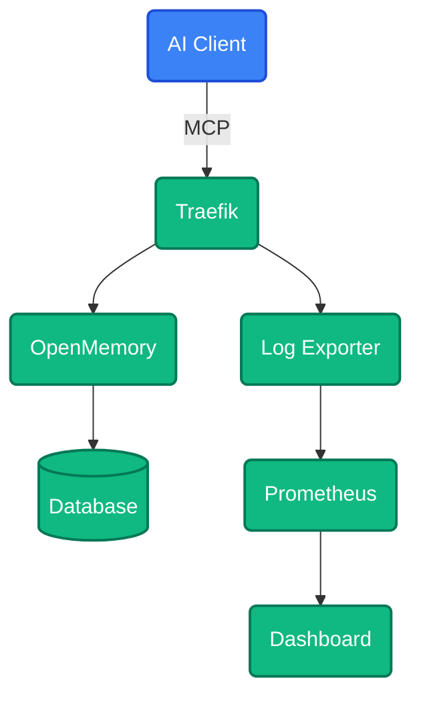

<div align="center">
  <p>
    <a href="https://cybermem.dev">
      
    </a>
  </p>
  <p>
    <a href="https://cybermem.dev/docs"></a>
    <a href="https://www.npmjs.com/package/@cybermem/mcp-server"></a>
    <a href="https://github.com/mikhailkogan17/cybermem/actions/workflows/ci.yml"></a>
    
  </p>
  
  <picture>
    <source media="(prefers-color-scheme: dark)" srcset="README_assets/logo-dark.svg">
    <source media="(prefers-color-scheme: light)" srcset="README_assets/logo-light.svg">
    
  </picture>

  <h3>Universal Long-Term Memory for AI Agents</h3>
  <p>Production-grade <strong>MCP Server</strong> • <strong>Docker Compose</strong> • <strong>Helm Charts</strong> • <strong>Prometheus</strong> • <strong>Traefik</strong></p>
  <p>Based on <a href="https://github.com/CaviraOSS/OpenMemory">OpenMemory</a></p>
</div>

## Features

| Feature                    | Description                                                                    |
| :------------------------- | :----------------------------------------------------------------------------- |
| **MCP Protocol**           | Native Model Context Protocol support for Claude, Cursor, and other AI clients |
| **Multi-Platform**         | Deploy on Mac, Raspberry Pi, or Cloud VPS with one command                     |
| **Infrastructure as Code** | Production-ready Docker Compose, Helm Charts, Ansible Playbooks                |
| **Observability**          | Built-in Prometheus metrics, Grafana dashboards, audit logs                    |
| **Security**               | Traefik reverse proxy, Tailscale Funnel for zero-config HTTPS                  |

## Quick Start

```bash
npx @cybermem/cli deploy
```

> [!TIP]
> **Raspberry Pi & Cloud/VPS Users**
>
> For edge and cloud deployment guides, visit **[cybermem.dev/docs](https://cybermem.dev/docs)**.

## Architecture



## Repository Structure

```
cybermem/
├── packages/
│   ├── cli/          # @cybermem/cli - Deployment CLI
│   ├── mcp/          # @cybermem/mcp-server - MCP Server
│   └── dashboard/    # @cybermem/dashboard - Monitoring UI
├── docs/             # Documentation
├── external/
│   └── openmemory/   # OpenMemory submodule
└── patches/          # OpenMemory customizations
```

## Documentation

Full documentation available at **[cybermem.dev/docs](https://cybermem.dev/docs)** (or browse links below):

| Guide                                                                                  | Description                       |
| :------------------------------------------------------------------------------------- | :-------------------------------- |
| [Quick Start](https://github.com/mikhailkogan17/cybermem/blob/main/docs/quickstart.md) | Get running in 5 minutes          |
| [Local Setup](https://github.com/mikhailkogan17/cybermem/blob/main/docs/local.md)      | Mac/Linux development environment |
| [Raspberry Pi](https://github.com/mikhailkogan17/cybermem/blob/main/docs/rpi.md)       | Edge deployment with Tailscale    |
| [Cloud/VPS](https://github.com/mikhailkogan17/cybermem/blob/main/docs/vps.md)          | Production Kubernetes deployment  |
| [MCP Integration](https://github.com/mikhailkogan17/cybermem/blob/main/docs/mcp.md)    | Connect Claude, Cursor, and more  |

## License

MIT © [Mikhail Kogan](https://github.com/mikhailkogan17)
