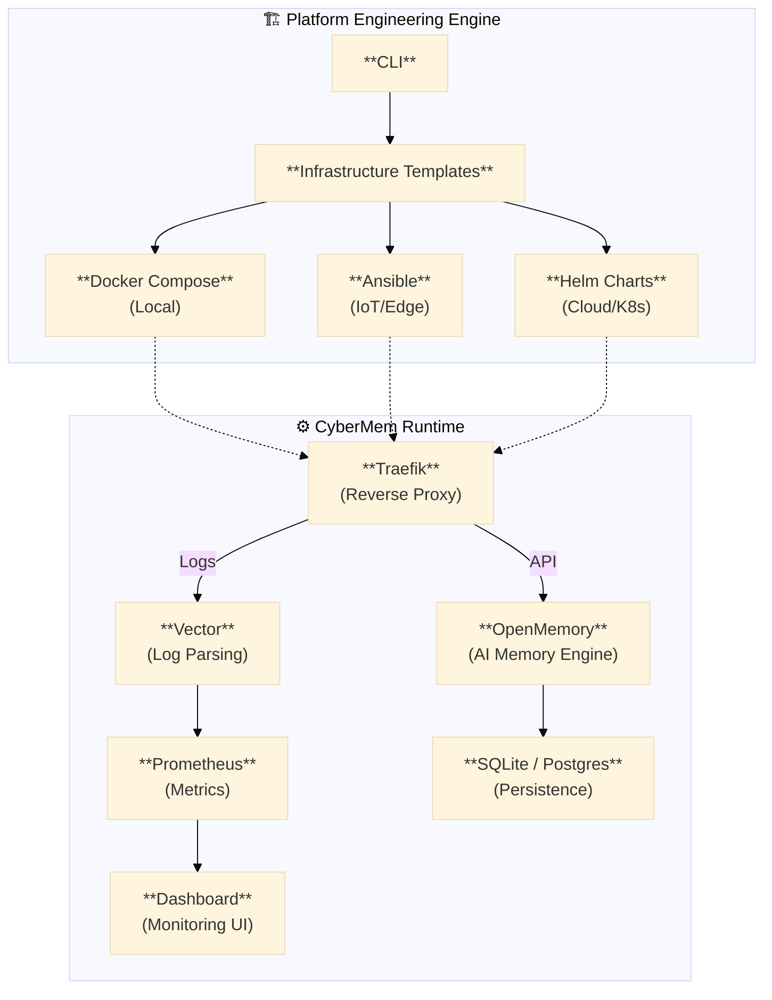

<div align="center">
  <p>
    <a href="https://cybermem.dev"></a>
    <a href="https://docs.cybermem.dev"></a>
    <a href="https://www.npmjs.com/package/@cybermem/mcp-server"></a>
    <a href="https://github.com/mikhailkogan17/cybermem/actions/workflows/ci.yml"></a>
    
  </p>
  
  <picture>
    <source media="(prefers-color-scheme: dark)" srcset="README_assets/logo-dark.svg" width="490">
    <source media="(prefers-color-scheme: light)" srcset="README_assets/logo-light.svg" width="490">
    
  </picture>

  <h3>Your AI Memory — Deploy Anywhere</h3>
  <p><em>Platform Engineering MCP Server for DevOps & AI Teams</em></p>

  ---

  <p><strong>Production-grade MCP Server</strong><br>
  <strong>Docker Compose</strong> • <strong>Helm Charts</strong> • <strong>Ansible Playbooks</strong> • <strong>Prometheus</strong> • <strong>Traefik</strong> • Based on <a href="https://github.com/CaviraOSS/OpenMemory">CaviraOSS/OpenMemory</a></p>
</div>

## Features

| Feature                    | Description                                                                    |
| -------------------------- | ------------------------------------------------------------------------------ |
| **Model Context Protocol** | Native Model Context Protocol support for Claude, Cursor, and other AI clients |
| **Multi-Platform**         | Deploy on Mac, Raspberry Pi, or Cloud VPS with one command                     |
| **Infrastructure as Code** | Production-ready **Docker Compose**, **Helm Charts**, **Ansible Playbooks**    |
| **Observability**          | Built-in Prometheus metrics, Grafana dashboards, audit logs                    |
| **Security**               | Traefik reverse proxy, Tailscale Funnel for zero-config HTTPS                  |

## Try It Out!

To try CyberMem on your local machine, run:
```bash
npx @cybermem/mcp
```
and follow the instructions in terminal.

**Full Quick Start guide for every platform is available at [cybermem.dev/#quickstart](https://cybermem.dev/#quickstart).**

## Why CyberMem?

> **Problem:** Your AI tools (Claude, Cursor, Antigravity) don't share memory. Each session starts fresh.
>
> **Solution:** CyberMem gives them a shared, persistent memory layer.

| Without CyberMem                      | With CyberMem                        |
| ------------------------------------- | ------------------------------------ |
| Claude forgets your project context   | All tools remember your preferences  |
| Cursor doesn't know your coding style | Context persists across sessions     |
| Each tool has separate knowledge      | One unified memory for all AI agents |

**For Platform Engineers:** CyberMem also demonstrates Infrastructure as Code practices — CLI generates Docker Compose, Ansible Playbooks, or Helm Charts depending on your target platform.

## Architecture Overview



## Project Structure (Monorepo)

```
cybermem/
├── packages/
│   ├── core/                 # AI memory engine (Node.js)
│   │   ├── src/
│   │   └── __tests__/
│   ├── cli/                  # Command-line tool (TypeScript)
│   │   ├── src/              # CLI logic
│   │   ├── templates/        # ⭐ Infrastructure templates
│   │   │   ├── docker-compose.yml
│   │   │   ├── k8s/
│   │   │   │   ├── deployment.yaml
│   │   │   │   ├── service.yaml
│   │   │   │   └── ingress.yaml
│   │   │   └── aws/
│   │   │       └── ecs-task-def.json
│   │   └── e2e/              # ⭐ End-to-end tests
│   │       ├── basic.test.ts         # Smoke test
│   │       ├── k8s.test.ts           # K8s deployment test
│   │       └── docker.test.ts        # Docker test
│   └── docs/                 # Documentation site
├── .github/
│   └── workflows/            # ⭐ CI/CD pipelines
│       ├── test.yml          # Run tests on every PR
│       ├── publish.yml       # Auto-publish on release
│       └── e2e.yml           # E2E tests in CI
└── README.md
```

**Key innovation:** `packages/cli/templates/` contains the **infrastructure-as-code templates**. 
The CLI reads these, interpolates variables, and generates production configs.

## Documentation

Full documentation available at **[docs.cybermem.dev](https://docs.cybermem.dev)**:

| Guide                                            | Description                       |
| :----------------------------------------------- | :-------------------------------- |
| [Local Setup](https://docs.cybermem.dev/local)   | Mac/Linux development environment |
| [Raspberry Pi](https://docs.cybermem.dev/rpi)    | Edge deployment with Tailscale    |
| [Cloud/VPS](https://docs.cybermem.dev/vps)       | Production Kubernetes deployment  |
| [MCP Integration](https://docs.cybermem.dev/mcp) | Connect Claude, Cursor, and more  |

## Contributing

Contributions are welcome! See [CONTRIBUTING.md](CONTRIBUTING.md) for development setup and guidelines.

## License

MIT © [Mikhail Kogan](https://github.com/mikhailkogan17)
