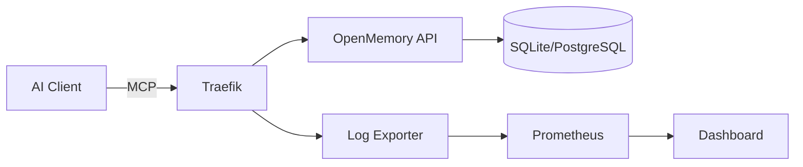

<div align="center">
  <p>
    <a href="https://cybermem.dev"></a>
    <a href="https://www.npmjs.com/package/@cybermem/mcp-server"></a>
    <a href="https://github.com/mikhailkogan17/cybermem/actions/workflows/ci.yml"></a>
    
  </p>
  
  <picture>
    <source media="(prefers-color-scheme: dark)" srcset="README_assets/logo-dark.svg">
    <source media="(prefers-color-scheme: light)" srcset="README_assets/logo-light.svg">
    
  </picture>

  <h3>Universal Long-Term Memory for AI Agents</h3>
  <p>Production-grade <strong>MCP Server</strong> • <strong>Docker Compose</strong> • <strong>Helm Charts</strong> • <strong>Prometheus</strong> • <strong>Traefik</strong></p>
  <p>Based on <a href="https://github.com/CaviraOSS/OpenMemory">OpenMemory</a></p>
  
  <a href="https://cybermem.dev/docs/quickstart"><strong>📖 Quick Start →</strong></a>
</div>

---

## Features

| Feature                    | Description                                                                    |
| -------------------------- | ------------------------------------------------------------------------------ |
| **MCP Protocol**           | Native Model Context Protocol support for Claude, Cursor, and other AI clients |
| **Multi-Platform**         | Deploy on Mac, Raspberry Pi, or Cloud VPS with one command                     |
| **Infrastructure as Code** | Production-ready Docker Compose, Helm Charts, Ansible Playbooks                |
| **Observability**          | Built-in Prometheus metrics, Grafana dashboards, audit logs                    |
| **Security**               | Traefik reverse proxy, Tailscale Funnel for zero-config HTTPS                  |

## Quick Start

```bash
npx @cybermem/cli deploy
```

<details>
<summary><strong>🍎 Local (Mac/Linux)</strong></summary>

```bash
# One-liner installation
npx @cybermem/cli deploy --target local

# Access points
# Dashboard: http://localhost:3000
# MCP API:   http://localhost:8626/mcp
```
</details>

<details>
<summary><strong>🍓 Raspberry Pi</strong></summary>

```bash
# Deploy with Tailscale for remote access
npx @cybermem/cli deploy --target rpi --remote-access

# Features: SQLite, Ollama embeddings, zero-config HTTPS via Tailscale Funnel
```
</details>

<details>
<summary><strong>☁️ Cloud/VPS</strong></summary>

```bash
# Deploy with PostgreSQL and auto-SSL
npx @cybermem/cli deploy --target vps

# Features: PostgreSQL, OpenAI embeddings, Traefik auto-cert
```
</details>

## Architecture



## Repository Structure

```
cybermem/
├── packages/
│   ├── cli/          # @cybermem/cli - Deployment CLI
│   ├── mcp/          # @cybermem/mcp-server - MCP Server
│   └── dashboard/    # @cybermem/dashboard - Monitoring UI
├── docs/             # Documentation
├── external/
│   └── openmemory/   # OpenMemory submodule
└── patches/          # OpenMemory customizations
```

## Documentation

Full documentation available at **[cybermem.dev/docs](https://cybermem.dev/docs)**

| Guide                                               | Description                       |
| --------------------------------------------------- | --------------------------------- |
| [Quick Start](https://cybermem.dev/docs/quickstart) | Get running in 5 minutes          |
| [Local Setup](https://cybermem.dev/docs/local)      | Mac/Linux development environment |
| [Raspberry Pi](https://cybermem.dev/docs/rpi)       | Edge deployment with Tailscale    |
| [Cloud/VPS](https://cybermem.dev/docs/vps)          | Production Kubernetes deployment  |
| [MCP Integration](https://cybermem.dev/docs/mcp)    | Connect Claude, Cursor, and more  |

## Contributing

We welcome contributions! See [CONTRIBUTING.md](CONTRIBUTING.md) for guidelines.

## License

MIT © [Mikhail Kogan](https://github.com/mikhailkogan17)
