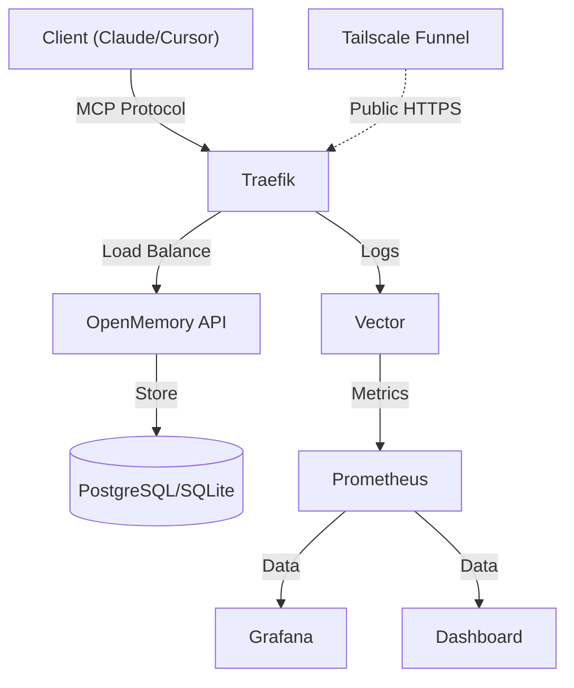

<div align="center">
  <p>
    <a href="https://github.com/mikhailkogan17/cybermem/actions/workflows/ci.yml"></a>
    <a href="https://www.npmjs.com/package/@cybermem/mcp-server"></a>
    
    
  </p>
  
  <picture>
    <source media="(prefers-color-scheme: dark)" srcset="README_assets/logo-dark.svg">
    <source media="(prefers-color-scheme: light)" srcset="README_assets/logo-light.svg">
    
  </picture>

  <p><strong>Universal Long-Term Memory for any AI Agent.</strong></p>
  <p>Based on <a href="https://github.com/CaviraOSS/OpenMemory">OpenMemory</a>.</p>
</div>

## Why CyberMem?

- **Easy to Install**: Get started in seconds with a single command. No complex setup required.
- **Universal**: Runs smoothly on your Mac, Raspberry Pi, or high-performance Cloud VPS.
- **Infrastructure as Code**: Production-grade templates (Helm Charts, Ansible Playbooks, Docker Compose) built into the CLI.
- **Secure & Controlled**: Enterprise-grade monitoring and full sovereignty over your memory data.

## 🚀 Installation

### Quick Start
```bash
# Install and deploy in one command
npm install -g @cybermem/cli && cybermem deploy
```

For advanced deployments (Raspberry Pi, Cloud VPS), see our [Documentation](https://cybermem.dev/docs).

## � Security

CyberMem adapts security to your deployment environment:

| Environment      | HTTPS                          | Auth                                |
| ---------------- | ------------------------------ | ----------------------------------- |
| **Local**        | Not needed (localhost only)    | Optional — keyless localhost access |
| **Raspberry Pi** | Tailscale Funnel (zero-config) | API key required for remote         |
| **Cloud/VPS**    | Caddy/Traefik auto-cert        | API key always required             |

```bash
# RPi with Tailscale remote access
cybermem deploy --target rpi --remote-access

# Cloud with auto-SSL via Caddy
cybermem deploy --target vps
```

### Quick Access (Local)

After installation, access your CyberMem instance:

- **Dashboard**: [http://localhost:3000](http://localhost:3000) (password: `admin`)
- **MCP API**: `http://localhost:8626/mcp` (for AI clients)
- **Prometheus**: [http://localhost:9092](http://localhost:9092) (metrics)


## �📊 Dashboard

Manage your agents' memories with a beautiful, real-time interface.

<!--
</img>
</img>
</img>
</img>
-->

- **Real-time Metrics**: Throughput, latency, and error rates.
- **Memory Inspector**: View and edit stored memories.

## 📚 Documentation

Visit [cybermem.dev/docs](https://cybermem.dev/docs) for full guides.

## 🏗 Architecture



## 📦 CLI Templates

The `@cybermem/cli` includes production-ready deployment templates:

| Template              | Use Case                 | Location                       |
| --------------------- | ------------------------ | ------------------------------ |
| **Docker Compose**    | Local & RPi deployment   | `templates/docker-compose.yml` |
| **Helm Charts**       | Kubernetes (K8s/K3s)     | `templates/charts/cybermem/`   |
| **Ansible Playbooks** | RPi fleet automation     | `templates/ansible/`           |
| **Monitoring Stack**  | Grafana + Prometheus     | `templates/monitoring/`        |
| **Tailscale Funnel**  | Zero-config public HTTPS | Built into `--remote-access`   |

See [`packages/cli/templates/`](packages/cli/templates/) for all configurations.

## 🤝 Community & Contributing

We welcome contributions! Please see our [CONTRIBUTING.md](CONTRIBUTING.md) for details on how to get started, development workflow, and code standards.

## License

MIT © [Mikhail Kogan](https://github.com/mikhailkogan17)


