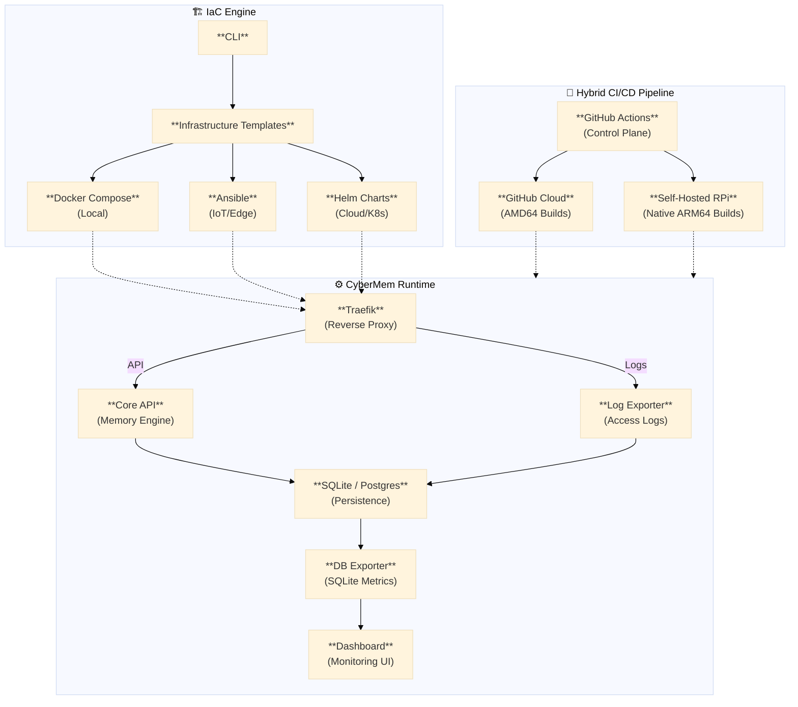

<div align="center">
  <p>
    <a href="https://cybermem.dev"></a>
    <a href="https://docs.cybermem.dev"></a>
    <a href="https://github.com/mikhailkogan17/cybermem/actions/workflows/build-images.yml"></a>
    <a href="https://www.npmjs.com/package/@cybermem/mcp"></a>
    
  </p>
  
  <picture>
    <source media="(prefers-color-scheme: dark)" srcset="README_assets/logo-dark.svg" width="490">
    <source media="(prefers-color-scheme: light)" srcset="README_assets/logo-light.svg" width="490">
    
  </picture>

  <h3>Your AI Memory — Deploy Anywhere</h3>
  <p><em>Platform Engineering MCP Server for DevOps & AI Teams</em></p>
  <p><strong><a href="https://cybermem.dev">cybermem.dev</a></strong></p>

---

  <p><strong>Production-grade MCP Server</strong><br>
  <strong>Docker Compose</strong> • <strong>Helm Charts</strong> • <strong>Ansible Playbooks</strong> • <strong>SQLite</strong> • <strong>Traefik</strong></p>
</div>

## Features

| Feature                    | Description                                                                           |
| -------------------------- | ------------------------------------------------------------------------------------- |
| **Model Context Protocol** | Native Model Context Protocol support for Claude, Cursor, and other AI clients        |
| **Multi-Platform**         | Deploy on Mac, Raspberry Pi, or Cloud VPS with one command                            |
| **Infrastructure as Code** | Production-ready **Ansible Playbooks**, **Helm Charts**, **Docker Compose**           |
| **Observability**          | Built-in SQLite activity metrics, beautiful time-series charts, audit logs            |
| **Ansible-First Prod**     | **Senior DevOps Workflow**: Automated deployment, health-checks, and state management |
| **Hybrid CI/CD**           | **Self-Hosted RPi Runner** for native 64-bit ARM builds + GitHub Cloud for x86        |
| **Security**               | Traefik reverse proxy, Tailscale Funnel for zero-config HTTPS                         |

To install CyberMem on your local machine, run:

```bash
npx @cybermem/cli install
```

and follow the instructions in terminal.

**Full Quick Start guide for every platform is available at [cybermem.dev/#quickstart](https://cybermem.dev/#quickstart).**

## Why CyberMem?

> **Problem:** Your AI tools (Claude, Cursor, Antigravity) don't share memory. Each session starts fresh.
>
> **Solution:** CyberMem gives them a shared, persistent memory layer.

| Without CyberMem                      | With CyberMem                        |
| ------------------------------------- | ------------------------------------ |
| Claude forgets your project context   | All tools remember your preferences  |
| Cursor doesn't know your coding style | Context persists across sessions     |
| Each tool has separate knowledge      | One unified memory for all AI agents |

**For Platform Engineers:** CyberMem demonstrates advanced Infrastructure practices:
- **IaC Automation:** CLI generates Docker Compose, Ansible, or Helm depending on the target.
- **Hybrid CI:** Leverages a private Raspberry Pi runner to bypass QEMU overhead, achieving native ARM64 build speeds.
- **Zero-Trust Access:** Integrates Tailscale Funnel for secure, public access without port forwarding.

## Architecture Overview



## CLI Reference

CyberMem CLI provides a standardized set of commands for complete lifecycle management:

```bash
npx @cybermem/cli install    # Install/Initialize services (Mac/RPi/VPS)
npx @cybermem/cli uninstall  # Stop and teardown services
npx @cybermem/cli upgrade    # Pull latest images and update instance
npx @cybermem/cli backup     # Create a data backup (.tar.gz)
npx @cybermem/cli restore    # Restore from a backup file
npx @cybermem/cli reset      # Wipe database (Destructive!)
npx @cybermem/cli dashboard  # Open monitoring dashboard
```

> [!IMPORTANT]
> **Ansible-First Prod**: For Raspberry Pi or remote servers, the CLI automatically leverages **Ansible** to ensure state-consistent, safe, and verifiable deployments.

## Project Structure (Monorepo)

```
cybermem/
├── packages/
│   ├── cli/                  # Command-line tool (TypeScript)
│   │   ├── src/              # CLI logic
│   │   └── templates/        # ⭐ Infrastructure templates
│   ├── mcp/                  # MCP Server & Core Engine (TypeScript)
│   │   └── src/              # Tooling & Memory Logic
│   └── dashboard/            # Monitoring UI (Next.js)
├── docs/                     # Documentation sources
├── .github/
│   └── workflows/            # ⭐ CI/CD pipelines
└── README.md
```

**Key innovation:** `packages/cli/templates/` contains the **infrastructure-as-code templates**.
The CLI reads these, interpolates variables, and generates production configs.

## Documentation

Full documentation available at **[docs.cybermem.dev](https://docs.cybermem.dev)**:

| Guide                                                   | Description                          |
| :------------------------------------------------------ | :----------------------------------- |
| [Local Setup](https://docs.cybermem.dev/local)          | Mac/Linux development environment    |
| [Ansible Deployment](https://docs.cybermem.dev/ansible) | **Production standard** for RPi/Edge |
| [Raspberry Pi](https://docs.cybermem.dev/rpi)           | Edge deployment with Tailscale       |
| [Cloud/VPS](https://docs.cybermem.dev/vps)              | Production Kubernetes deployment     |
| [MCP Integration](https://docs.cybermem.dev/mcp)        | Connect Claude, Cursor, and more     |

## 🛠️ Architecture Narratives

### Why Traefik for ForwardAuth?
Standard Node.js auth middlewares often fail on underpowered Edge devices (RPi) or cause high latency. CyberMem uses **Traefik as a Reverse Proxy** to handle authentication at the networking layer. This allows the Core API to remain "clean" and deterministic, while Traefik extracts identity headers (`X-Client-Name`) into audit logs before the request even hits the application.

### Why Ansible for RPi but Helm for Cloud?
We follow the **Infrastructure Appropriateness** principle. 
- **RPi/Edge:** Needs mutable state management and OS-level hardening (docker-compose, systemd). **Ansible** ensures idempotent state without the overhead of a control plane.
- **Cloud/VPS:** Scaling and high availability are paramount. **Helm** allows us to leverage Kubernetes native primitives (Ingress, PVC, HPA) for a truly elastic platform.

### Verification & Proof-of-Work

We use `tools/test-k8s.sh` and the CyberMem Gatekeeper to guarantee that every release is stable. Below is the raw console verification of a production-grade deployment.

#### 1. Kubernetes Resource Tree (Architecture Proof)
```text
NAMESPACE: cybermem
NAME                                         READY   STATUS    RESTARTS   AGE
pod/cybermem-dashboard-6dd67f5586-djwwh      1/1     Running   0          2m
pod/cybermem-openmemory-65fdf6d85c-g628g     1/1     Running   0          2m

NAME                  TYPE           CLUSTER-IP     EXTERNAL-IP   PORT(S)    AGE
cybermem-lb           LoadBalancer   10.43.0.1      127.0.0.1     8626/TCP   2m
cybermem-dashboard    ClusterIP      10.43.79.62    <none>        3000/TCP   2m
cybermem-openmemory   ClusterIP      10.43.95.212   <none>        8080/TCP   2m
```

#### 2. Ansible Idempotency (Operational Maturity)
```bash
# Proof of zero-drift state management on Raspberry Pi
ansible-playbook -i inventory/hosts.ini playbooks/deploy-cybermem.yml

PLAY [Deploy CyberMem to Raspberry Pi] ****************************************

TASK [Gathering Facts] ********************************************************
ok: [raspberrypi.local]

TASK [cybermem : Pull latest images from GHCR] ********************************
ok: [raspberrypi.local] => (changed=false)

TASK [cybermem : Start services] **********************************************
ok: [raspberrypi.local] => (changed=false)

PLAY RECAP ********************************************************************
raspberrypi.local   : ok=15   changed=0    unreachable=0    failed=0    skipped=0
```

## Contributing

Contributions are welcome! See [CONTRIBUTING.md](CONTRIBUTING.md) for development setup and guidelines.

### Development & Debugging

**MCP Inspector** - Interactive debugging tool for MCP server development:

```bash
# Start inspector (auto-opens browser UI)
cd packages/mcp
npm run inspect

# Or inspect a remote instance
npx @modelcontextprotocol/inspector npx @cybermem/mcp \
  --url https://your-server.com:8626 \
  --token sk-your-token
```

The inspector provides an interactive UI for testing tools, inspecting requests/responses, and verifying protocol compliance.

See [docs/mcp.md](docs/mcp.md) for full debugging guide.

## License

MIT

Created by [Mikhail Kogan](https://github.com/mikhailkogan17) | [LinkedIn](https://linkedin.com/in/mikhail-kogan-platform)
