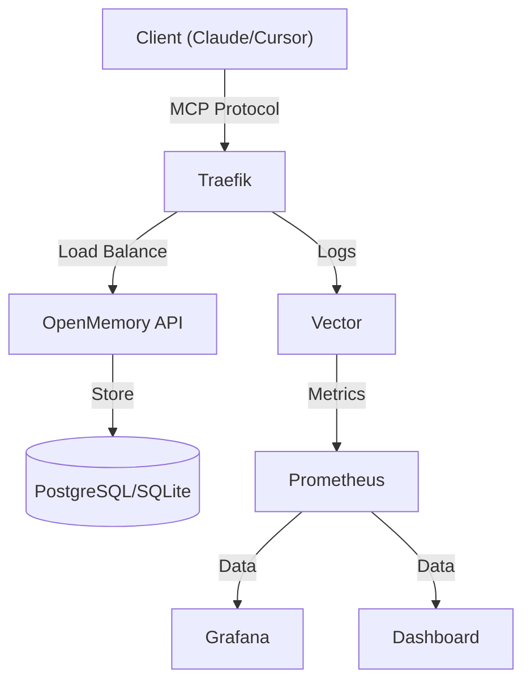

<div align="center">
  <p>
    <a href="https://github.com/mikhailkogan17/cybermem/actions/workflows/ci.yml"></a>
    
    
    
  </p>
  
  <picture>
    <source media="(prefers-color-scheme: dark)" srcset="README_assets/images/logo-dark.svg">
    <source media="(prefers-color-scheme: light)" srcset="README_assets/images/logo-light.svg">
    
  </picture>

  <p><strong>Universal Long-Term Memory for any AI Agent.</strong></p>
  <p>Based on <a href="https://github.com/CaviraOSS/OpenMemory">OpenMemory</a>.</p>
</div>

## Why CyberMem?

- **Easy to Install**: Get started in seconds with a single command. No complex setup required.
- **Universal**: Runs smoothy on your Mac, Raspberry Pi, or high-performance Cloud VPS.
- **Secure & Controlled**: Enterprise-grade monitoring and full sovereignty over your memory data.

## 🚀 Installation

### Desktop (Mac/Linux)
```bash
# Install and deploy in one command
npm install -g @cybermem/cli && cybermem deploy
```

### Raspberry Pi (Cluster)
```bash
curl -fsSL https://cybermem.dev/rpi | bash
```

### Cloud VPS (Kubernetes)
```bash
curl -fsSL https://cybermem.dev/cloud | bash
```

## 📊 Dashboard

Manage your agents' memories with a beautiful, real-time interface.

<!--
</img>
</img>
</img>
</img>
-->

- **Real-time Metrics**: Throughput, latency, and error rates.
- **Memory Inspector**: View and edit stored memories.
- **Documentation**: Visit [cybermem.dev/docs](https://cybermem.dev/docs) for full guides.

## 🏗 Architecture



## License

MIT © [Mikhail Kogan](https://github.com/mikhailkogan17)
