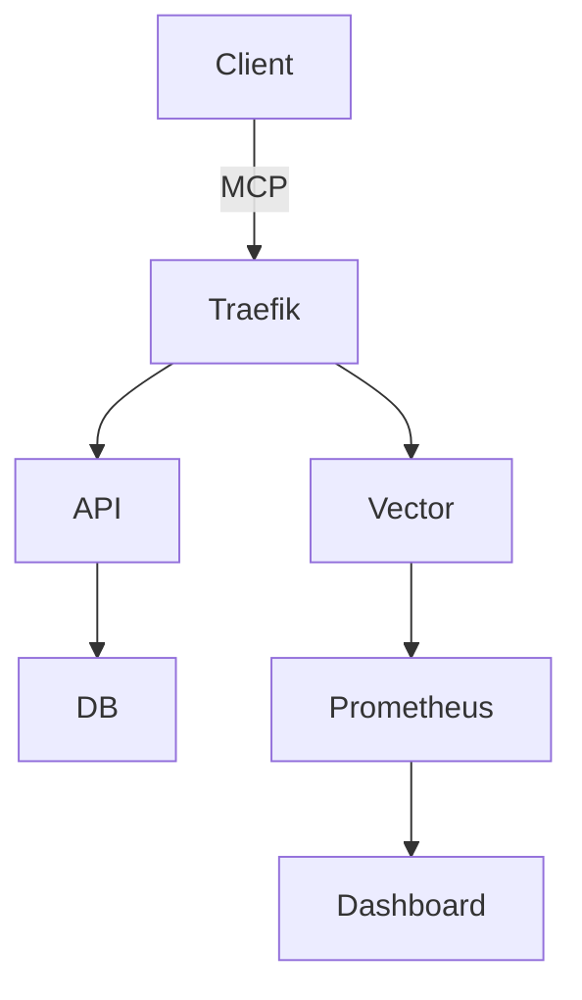

<div align="center">
  <p>
    <a href="https://cybermem.dev"></a>
    <a href="https://cybermem.dev/docs"></a>
    <a href="https://www.npmjs.com/package/@cybermem/mcp-server"></a>
    <a href="https://github.com/mikhailkogan17/cybermem/actions/workflows/ci.yml"></a>
    
  </p>
  
  <picture>
    <source media="(prefers-color-scheme: dark)" srcset="README_assets/logo-dark.svg" width="490">
    <source media="(prefers-color-scheme: light)" srcset="README_assets/logo-light.svg" width="490">
    
  </picture>

  <h3>Universal Long-Term Memory for AI Agents</h3>

  ---

  <p><strong>Production-grade MCP Server</strong><br>
  Docker Compose • Helm Charts • Prometheus • Traefik • Based on <a href="https://github.com/CaviraOSS/OpenMemory">OpenMemory</a></p>
</div>

## Features

**Model Context Protocol**: Native Model Context Protocol support for Claude, Cursor, and other AI clients

**Multi-Platform**: Deploy on Mac, Raspberry Pi, or Cloud VPS with one command

**Infrastructure as Code**: Production-ready Docker Compose, Helm Charts, Ansible Playbooks

**Observability**: Built-in Prometheus metrics, Grafana dashboards, audit logs

**Security**: Traefik reverse proxy, Tailscale Funnel for zero-config HTTPS

## Try It Out!

To try CyberMem on your local machine, run:
```bash
npx @cybermem/mcp
```
and follow the instructions in terminal.

**Full Quick Start guide for every platform is available at [cybermem.dev/#quickstart](https://cybermem.dev/#quickstart).**

## Architecture



## Repository Structure

```
cybermem/
├── packages/
│   ├── cli/          # @cybermem/cli - Deployment CLI
│   ├── mcp/          # @cybermem/mcp-server - MCP Server
│   └── dashboard/    # @cybermem/dashboard - Monitoring UI
├── docs/             # Documentation
├── external/
│   └── openmemory/   # OpenMemory submodule
└── patches/          # OpenMemory customizations
```

## Documentation

Full documentation available at **[cybermem.dev/docs](https://cybermem.dev/docs)** (or browse links below):

| Guide                                                                               | Description                       |
| :---------------------------------------------------------------------------------- | :-------------------------------- |
| [Local Setup](https://github.com/mikhailkogan17/cybermem/blob/main/docs/local.md)   | Mac/Linux development environment |
| [Raspberry Pi](https://github.com/mikhailkogan17/cybermem/blob/main/docs/rpi.md)    | Edge deployment with Tailscale    |
| [Cloud/VPS](https://github.com/mikhailkogan17/cybermem/blob/main/docs/vps.md)       | Production Kubernetes deployment  |
| [MCP Integration](https://github.com/mikhailkogan17/cybermem/blob/main/docs/mcp.md) | Connect Claude, Cursor, and more  |

## Contributing

Feel free to ...

## License

MIT © [Mikhail Kogan](https://github.com/mikhailkogan17)
