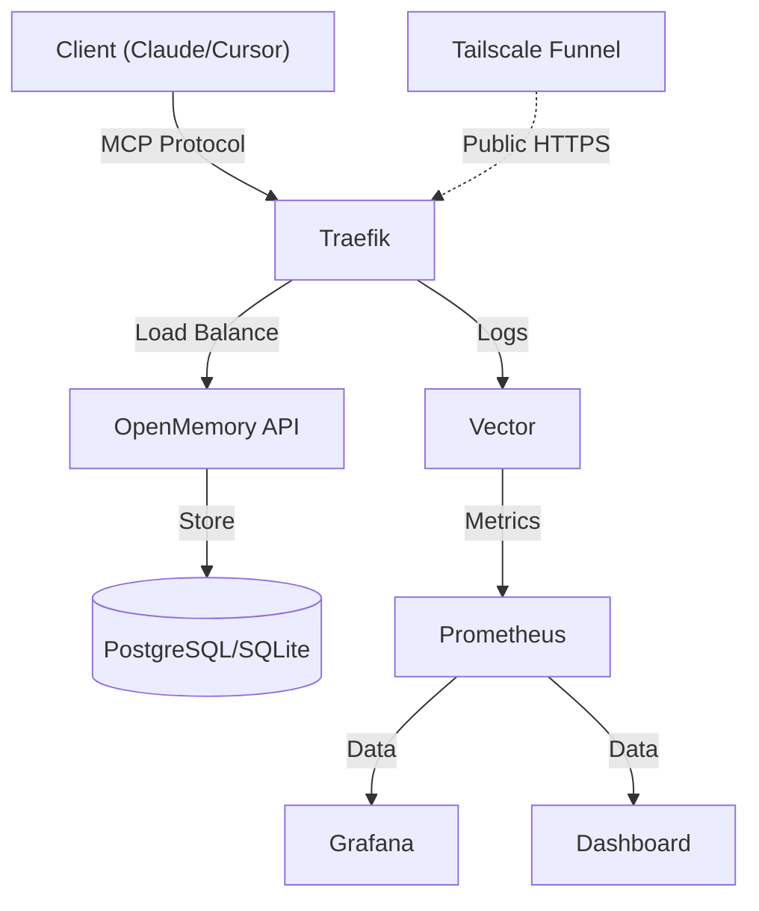

<div align="center">
  <p>
    <a href="https://github.com/mikhailkogan17/cybermem/actions/workflows/ci.yml"></a>
    
    
    
  </p>
  
  <picture>
    <source media="(prefers-color-scheme: dark)" srcset="README_assets/images/logo-dark.svg">
    <source media="(prefers-color-scheme: light)" srcset="README_assets/images/logo-light.svg">
    
  </picture>

  <p><strong>Universal Long-Term Memory for any AI Agent.</strong></p>
  <p>Based on <a href="https://github.com/CaviraOSS/OpenMemory">OpenMemory</a>.</p>
</div>

## Why CyberMem?

- **Easy to Install**: Get started in seconds with a single command. No complex setup required.
- **Universal**: Runs smoothy on your Mac, Raspberry Pi, or high-performance Cloud VPS.
- **Infrastructure as Code**: Production-grade IaC templates (Helm, Ansible, Terraform) built right into the CLI.
- **Secure & Controlled**: Enterprise-grade monitoring and full sovereignty over your memory data.

## 🚀 Installation

### Quick Start
```bash
# Install and deploy in one command
npm install -g @cybermem/cli && cybermem deploy
```

For advanced deployments (Raspberry Pi Cluster, Cloud VPS), see our [Documentation](https://cybermem.dev/docs).

## 📊 Dashboard

Manage your agents' memories with a beautiful, real-time interface.

<!--
</img>
</img>
</img>
</img>
-->

- **Real-time Metrics**: Throughput, latency, and error rates.
- **Memory Inspector**: View and edit stored memories.

## 📚 Documentation

Visit [cybermem.dev/docs](https://cybermem.dev/docs) for full guides.

## 🏗 Architecture



## 📦 CLI Templates

The `@cybermem/cli` includes production-ready deployment templates:

- **Docker Compose** — Local and RPi deployment
- **Helm Charts** — Kubernetes deployment
- **Ansible Playbooks** — RPi fleet management
- **Terraform Modules** — Cloud infrastructure provisioning (AWS/Azure/GCP)
- **Tailscale Funnel** — Zero-config public HTTPS

See [`packages/cli/templates/`](packages/cli/templates/) for all configurations.

## 🤝 Community & Contributing

We welcome contributions! Please see our [CONTRIBUTING.md](CONTRIBUTING.md) for details on how to get started, development workflow, and code standards.

## License

MIT © [Mikhail Kogan](https://github.com/mikhailkogan17)

