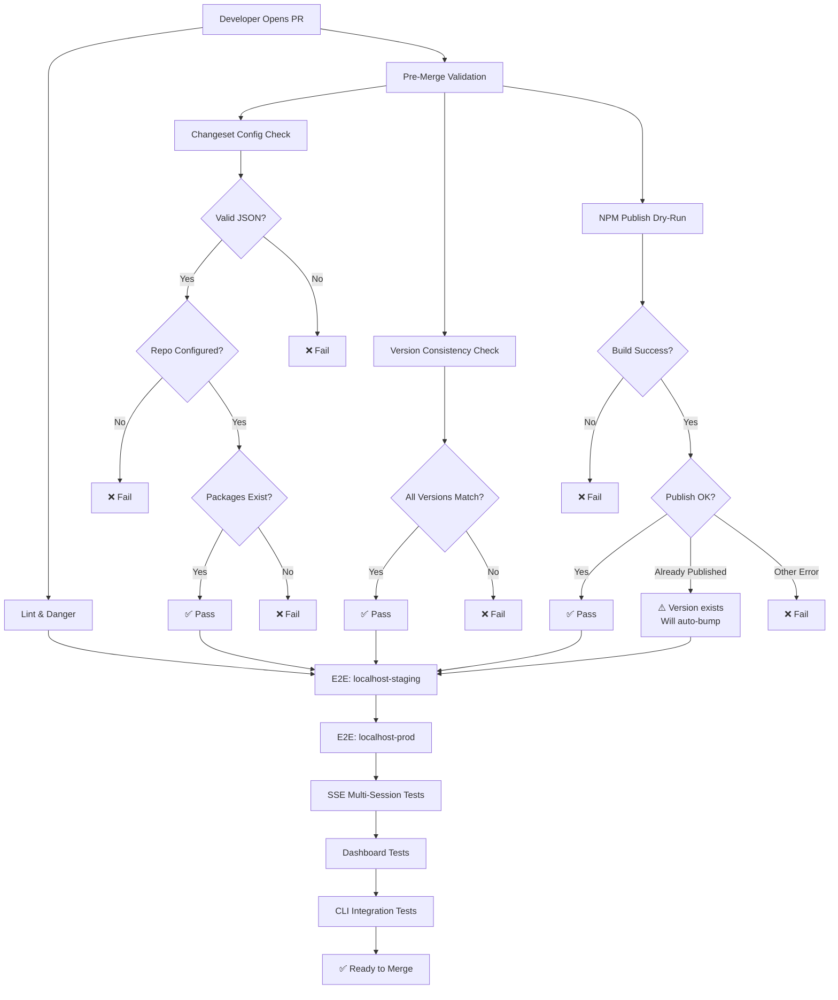
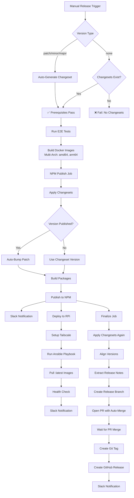

# CI/CD Workflow Diagram

This document describes the improved CI/CD pipeline for CyberMem releases.

## PR Validation Workflow

## Release Workflow

## Validation Gates

### Pre-Merge Validation Gates

| Gate | Purpose | Failure Impact |
|------|---------|----------------|
| **Changeset Config** | Ensure `.changeset/config.json` is valid | Prevents release workflow failures |
| **Version Consistency** | All linked packages have same version | Prevents NPM publish conflicts |
| **NPM Dry-Run** | Package structure is publishable | Detects build/packaging issues early |
| **Lint & Danger** | Code quality and PR completeness | Maintains code standards |

### E2E Test Matrix

| Environment | Port | Purpose |
|-------------|------|---------|
| **localhost-staging** | 8625 | Staging configuration validation |
| **localhost-prod** | 8626 | Production configuration validation |

### SSE Transport Tests

| Test | Purpose |
|------|---------|
| **Multi-Session** | Validates concurrent connections |
| **Rapid Connect/Disconnect** | Tests connection cleanup |
| **Malformed Requests** | Ensures graceful error handling |
| **Missing Headers** | Validates fallback behavior |

## Success Metrics

### Release Prep Time Reduction

**Before (0.12-0.14):**
- ~60% of commits for CI/CD stabilization
- Average 20+ fix commits per release
- Root causes: NPM OIDC, ARM64 builds, version mismatches

**Target (0.15+):**
- ≤20% of commits for CI/CD stabilization
- ≤3 fix commits per release
- Early validation catches issues before merge

### Key Improvements

1. **Early Failure Detection**: Validation gates run on every PR
2. **Version Management**: Automated version consistency checks
3. **SSE Stability**: Dedicated multi-session transport tests
4. **Documentation**: Release stability checklist with common failure modes
5. **Local Testing**: `npm run validate` script for pre-push checks

## Troubleshooting

See [CONTRIBUTING.md](../CONTRIBUTING.md#release-stability-checklist) for:
- Pre-release checklist
- Common failure modes and solutions
- Post-release verification steps
