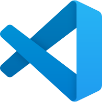
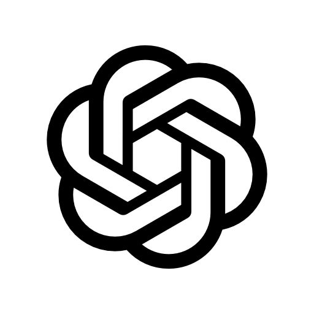
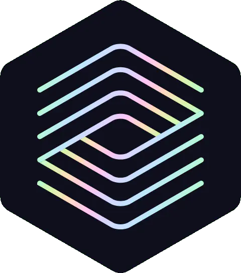

# MCP Integration Guide

The Model Context Protocol (MCP) allows AI coding assistants to connect directly to CyberMem. These instructions are synchronized with your dashboard.

##  Claude Desktop

To use CyberMem with Claude Desktop, you need to edit your configuration file.

1. Open Claude Desktop
2. Go to **Settings** > **Developer** > **Edit Config**
3. Add the configuration block below to your `claude_desktop_config.json`
4. Restart Claude Desktop to apply changes

```json
{
  "mcpServers": {
    "cybermem": {
      "url": "http://localhost:8080/mcp",
      "type": "sse"
    }
  }
}
```

##  Cursor

Cursor fully supports MCP. Configure it in the settings.

1. Open Cursor Settings (`Cmd` + `,`)
2. Navigate to **Features** > **MCP**
3. Click "Add New MCP Server"
4. Enter Name: `cybermem`
5. Enter Type: `SSE`
6. Enter URL: `http://localhost:8080/mcp`

##  VS Code

Requires the official MCP extension.

1. Install "MCP Servers" extension
2. Open Command Palette (`Cmd`+`Shift`+`P`)
3. Run **MCP: Manage Servers**
4. Add the configuration below

```json
{
  "mcpServers": {
    "cybermem": {
      "url": "http://localhost:8080/mcp",
      "type": "sse"
    }
  }
}
```

##  Windsurf

Windsurf supports MCP via configuration.

1. Open `~/.codeium/windsurf/mcp_config.json`
2. Add the configuration block

```json
{
  "mcpServers": {
    "cybermem": {
      "url": "http://localhost:8080/mcp",
      "type": "sse"
    }
  }
}
```

##  Warp

Warp integration coming soon.

##  Claude Code

Add the server directly via the command line.

1. Run the command below in your terminal

```bash
# Command to be added
```

##  ChatGPT

Requires Developer Mode.

1. Enable Developer Mode
2. Add Custom Server

##  Codex

Use this TOML configuration for Codex.

1. Endpoint Type: `SSE`
2. Copy the TOML block below

```toml
[mcp]
server_url = "http://localhost:8080/mcp"
api_key = "sk-cybermem-master-key-8f7a2b9c"
```

## Other Clients

For any other MCP-compliant client, use the following connection details:

- **Transport**: SSE (Server-Sent Events)
- **URL**: `http://localhost:8080/mcp`
