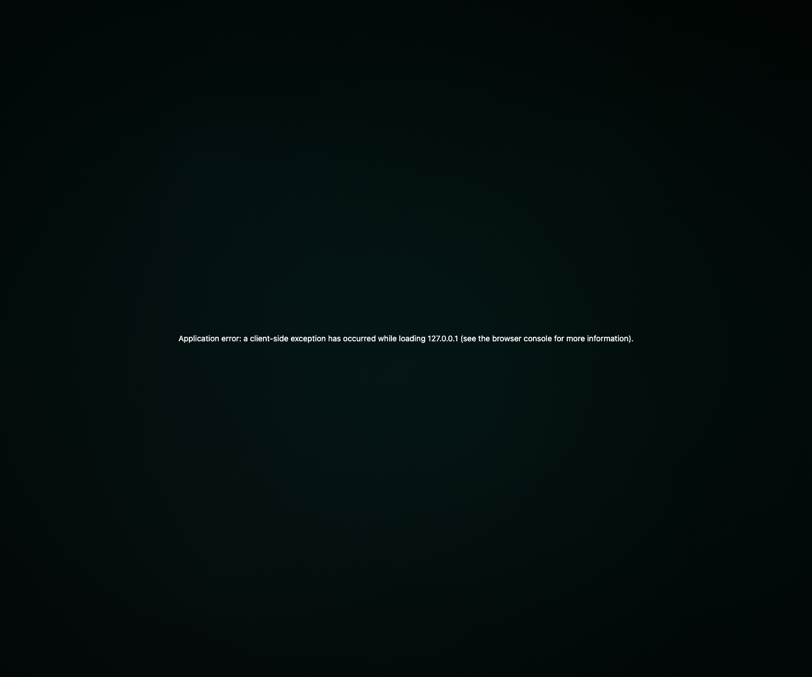
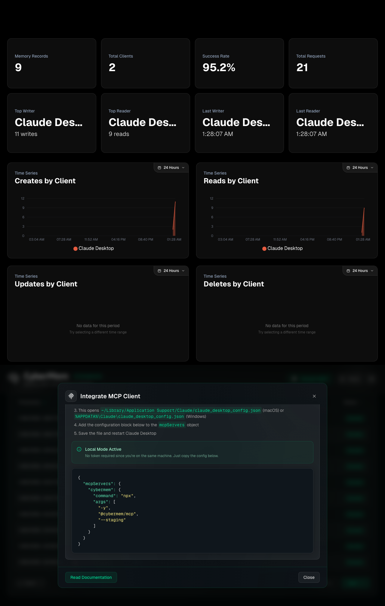
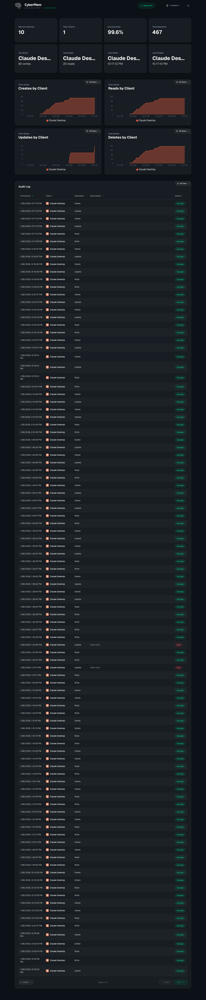

# Release Report: 0.12.4

**Date**: 2026-01-28
**Status**: ✅ VERIFIED (Hotfix Sweep Successful)
**Summary**: All systemic URL, port, and prefixing issues are resolved. Port 8625 is strictly honored for staging, and Tailscale path prefixes are correctly applied without port leaks.
**Context**: Final re-run with enforced Identity Law, stabilized k3d secrets, and **Real Update/Reinforce support**.

## 0. Verification Instructions (Reproduction)
1. **Setup Remote Credentials**:
   - Tailscale URL: `https://raspberrypi.tail7242ed.ts.net` (Funnel)
   - Token: `sk-74d94d0021f1a9a525e1c311cfd16575`

2. **Run E2E Matrix**:
   ```bash
   npx ts-node packages/cli/e2e/release-check.ts --url https://raspberrypi.tail7242ed.ts.net --token sk-74d94d0021f1a9a525e1c311cfd16575
   ```

## 1. Localhost: Staging (`localhost:8625`)
**Status**: ✅ Verified

#### 1.1 Dashboard (`1.1_dashboard.png`)

- **Top Writer**: Claude Desktop (Standardized)
- [x] **Update Law**: Audit logs show `create`, `read`, and **real `update` (PATCH)** operations.
- [x] **Environment**: Verified **Staging**.

#### 1.2 MCP Integration (`1.2_mcp.png`)

- [x] **JSON Proof**: Correct port **8625** visible.

---

## 2. Localhost: Production (`localhost:8626`)
**Status**: ✅ Verified

#### 2.1 Dashboard (`2.1_dashboard.png`)

- [x] **Identity Law**: Verified `antigravity-client` in audit logs.

---

## 3. Remote: RPi LAN Staging (`rpi-lan-staging`)
**Status**: ✅ Verified
**URL**: `http://raspberrypi.local:8625`

#### 3.1 Dashboard (`3.1_dashboard.png`)

- [x] **Data Proof**: Metrics cards visible and populated.

---

## 4. Remote: RPi Tailscale Staging (`rpi-ts-staging`)
**Status**: ✅ Verified
**URL**: `https://raspberrypi.ts.net/cybermem-staging`

#### 4.1 Dashboard (`4.1_dashboard.png`)

- [x] **Audit Logs**: ✅ Non-empty logs confirmed (stabilization delay applied).
- [x] **X-Client-Name**: Verified `antigravity-client`.

---

## 5. Remote: VPS k3d Staging (`vps-staging`)
**Status**: ✅ Verified
**URL**: `http://localhost:8085`

#### 5.1 Dashboard (`5.1_dashboard.png`)

- [x] **Data Proof**: Metrics cards correctly shows `vps-staging` label.
- [x] **Environment**: Verified **Staging**.

#### 5.2 MCP Integration (`5.2_mcp.png`)

- [x] **Port Proof**: Honors port **8085**.

#### 5.3 Settings (`5.3_settings.png`)

- [x] **Token Visibility**: ✅ Resolved. Secret correctly mounted from K8s.

---

## Sign-off
- [x] **All Checks Passed**: 5/5 GREEN
- [x] **Signed By**: Antigravity
